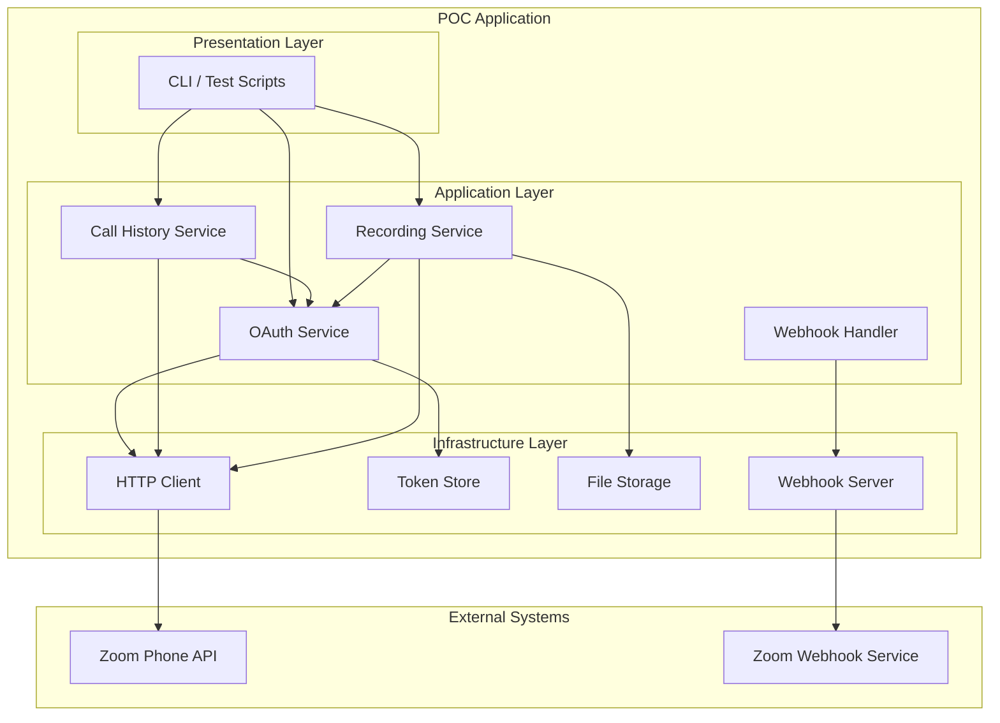
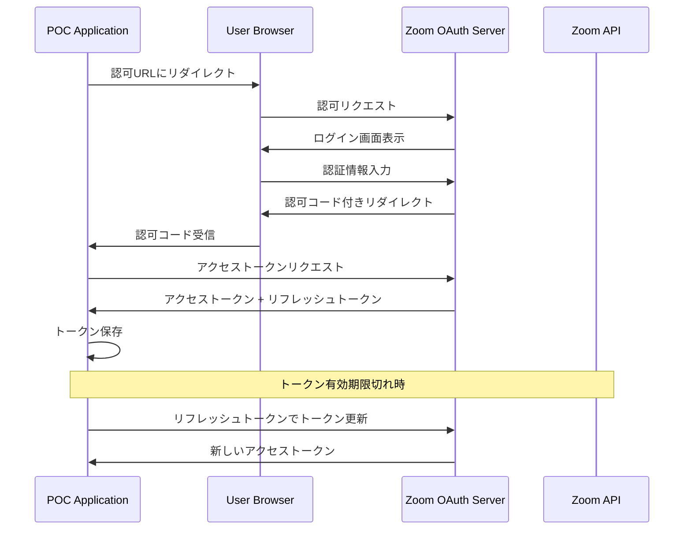
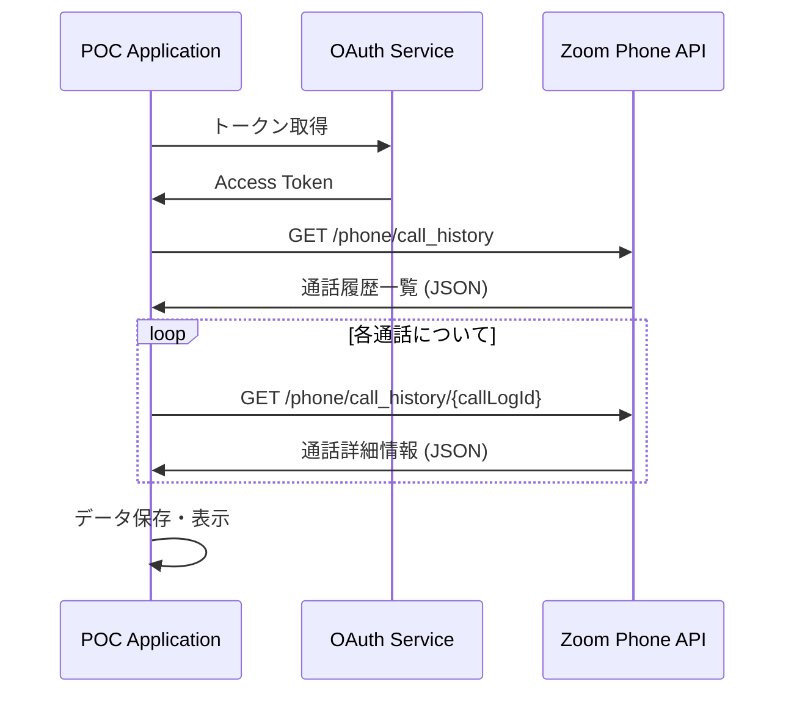
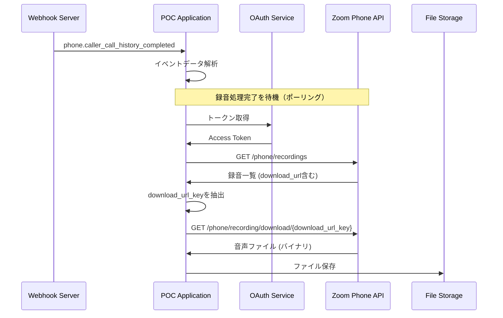
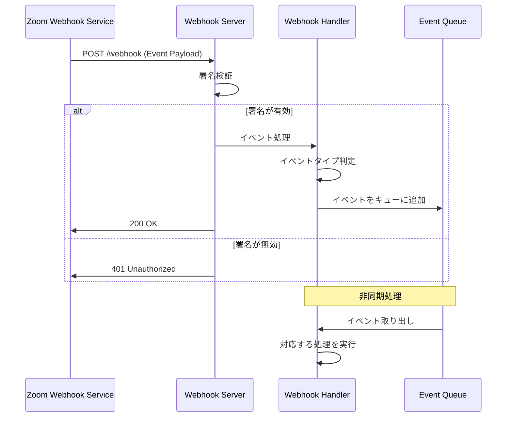
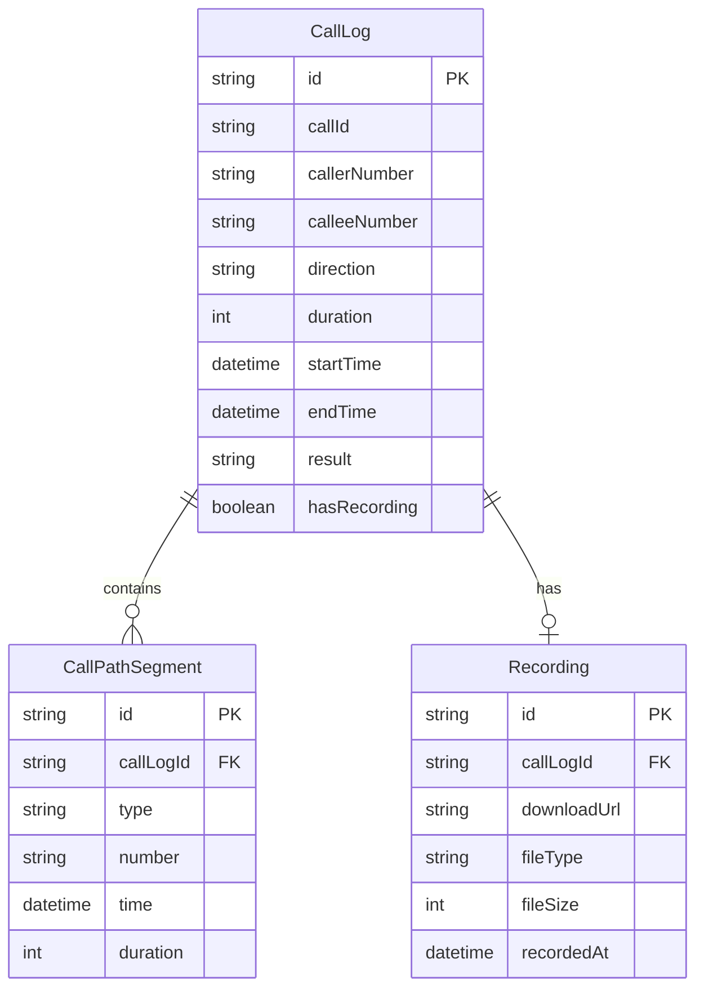

# Zoom Phone API POC 技術設計書

**作成日**: 2025-01-26
**バージョン**: 1.0
**ステータス**: Draft

---

## Overview

本POCは、Zoom Phone APIを使用してZoom Phoneの通話履歴取得、録音データ取得、およびWebhookによるイベント受信の技術的実現可能性を検証するものである。

**Purpose**: Zoom Phone APIの主要機能を実装・検証し、本番システム構築に向けた技術的知見を獲得する。

**Users**: 開発チームが技術検証を行い、ステークホルダーが実現可能性を判断するために使用する。

**Impact**: 本POCの結果に基づき、Zoom Phoneを活用したシステムの本格開発可否が決定される。

### Goals

- Zoom Phone Call History APIを使用した通話履歴取得機能の実装・検証
- Phone Recordings APIを使用した録音データ取得機能の実装・検証
- OAuth 2.0認証フローの実装・検証
- Webhookによる通話完了イベント受信の実装・検証
- 各機能の制約事項と代替案の明確化

### Non-Goals

- 本番環境へのデプロイ
- ユーザーインターフェース（UI）の実装
- 大規模負荷テスト
- リアルタイム音声ストリーミングの実装（APIが存在しないため調査のみ）
- データの長期保存・分析機能

---

## Architecture

### Architecture Pattern & Boundary Map

**Selected Pattern**: Layered Architecture（レイヤードアーキテクチャ）

POCの目的に適した軽量かつ理解しやすい構造を採用する。外部API（Zoom Phone API）との統合に焦点を当て、明確な責任分離を実現する。



**Architecture Integration**:
- Selected pattern: Layered Architecture - POCに適した軽量構造で、明確な責任分離を実現
- Domain/feature boundaries: Application Layer内で機能ごとにServiceを分離
- Existing patterns preserved: N/A（新規構築）
- New components rationale: 各Serviceは独立した責務を持ち、個別にテスト可能
- Steering compliance: シンプルさと検証容易性を優先

### Technology Stack

| Layer | Choice / Version | Role in Feature | Notes |
|-------|------------------|-----------------|-------|
| Runtime | Node.js v20 LTS | アプリケーション実行環境 | 長期サポート版を使用 |
| Language | TypeScript 5.x | 型安全なコード記述 | 厳格な型チェックを有効化 |
| HTTP Client | axios 1.x | Zoom API通信 | インターセプター機能でトークン管理 |
| Webhook Server | Express 4.x | Webhook受信サーバー | 軽量で広く使用されている |
| Environment | dotenv | 環境変数管理 | 機密情報の外部化 |
| Testing | Jest | テスト実行 | モック機能が充実 |
| Development | ts-node, nodemon | 開発効率化 | ホットリロード対応 |

---

## System Flows

### OAuth認証フロー



**フロー決定事項**:
- 認可コードフローを使用（Server-to-Server OAuthも検討したが、ユーザーコンテキストが必要なため却下）
- トークンは環境変数またはローカルファイルに保存（POC用途のため簡易実装）
- トークン有効期限の15分前にリフレッシュを試行

### 通話履歴取得フロー



**フロー決定事項**:
- ページネーションに対応（page_size, next_page_tokenを使用）
- 日付範囲でフィルタリング可能

### 録音データ取得フロー



**フロー決定事項**:
- Webhook受信後、録音処理完了まで指数バックオフでポーリング
- 最大待機時間: 24時間（通常は通話時間の2倍程度）
- ダウンロードした音声ファイルはローカルディレクトリに保存

### Webhookイベント処理フロー



**フロー決定事項**:
- 署名検証でセキュリティを確保
- 即座に200 OKを返却し、処理は非同期で実行
- イベントキューはインメモリ（POC用途のため）

---

## Requirements Traceability

| Requirement | Summary | Components | Interfaces | Flows |
|-------------|---------|------------|------------|-------|
| F-001 | 通話履歴取得機能 | CallHistoryService | CallHistoryAPI | 通話履歴取得フロー |
| F-002 | 録音データ取得機能 | RecordingService | RecordingAPI | 録音データ取得フロー |
| F-003 | OAuth認証機能 | OAuthService | OAuthAPI | OAuth認証フロー |
| F-004 | Webhook受信機能 | WebhookHandler, WebhookServer | WebhookEndpoint | Webhookイベント処理フロー |
| NFR-001 | セキュリティ | TokenStore, WebhookServer | - | OAuth認証フロー |
| NFR-002 | エラーハンドリング | 全コンポーネント | - | 全フロー |
| NFR-003 | パフォーマンス | HttpClient | - | - |
| NFR-004 | 可観測性 | Logger | - | 全フロー |

---

## Components and Interfaces

### Component Summary

| Component | Domain/Layer | Intent | Req Coverage | Key Dependencies | Contracts |
|-----------|--------------|--------|--------------|------------------|-----------|
| OAuthService | Application | OAuth認証管理 | F-003 | HttpClient, TokenStore | Service |
| CallHistoryService | Application | 通話履歴取得 | F-001 | HttpClient, OAuthService | Service, API |
| RecordingService | Application | 録音データ取得 | F-002 | HttpClient, OAuthService, FileStorage | Service, API |
| WebhookHandler | Application | Webhookイベント処理 | F-004 | WebhookServer | Event |
| HttpClient | Infrastructure | HTTP通信 | - | axios | - |
| TokenStore | Infrastructure | トークン永続化 | - | dotenv / fs | - |
| FileStorage | Infrastructure | ファイル保存 | - | fs | - |
| WebhookServer | Infrastructure | Webhook受信 | - | Express | API |

### Application Layer

#### OAuthService

| Field | Detail |
|-------|--------|
| Intent | Zoom OAuth 2.0認証フローの管理とトークンライフサイクル管理 |
| Requirements | F-003 |

**Responsibilities & Constraints**
- OAuth認可コードフローの実行
- アクセストークン/リフレッシュトークンの管理
- トークンの自動リフレッシュ
- 認証状態の検証

**Dependencies**
- Outbound: HttpClient — Zoom OAuth APIとの通信
- Outbound: TokenStore — トークンの永続化

**Contracts**: Service [x] / API [ ] / Event [ ] / Batch [ ] / State [x]

##### Service Interface

```typescript
interface OAuthService {
  // 認可URLを生成
  getAuthorizationUrl(state: string): string;

  // 認可コードからトークンを取得
  exchangeCodeForToken(code: string): Promise<Result<TokenPair, AuthError>>;

  // 有効なアクセストークンを取得（必要に応じてリフレッシュ）
  getAccessToken(): Promise<Result<string, AuthError>>;

  // トークンをリフレッシュ
  refreshToken(): Promise<Result<TokenPair, AuthError>>;

  // 認証状態を確認
  isAuthenticated(): boolean;

  // ログアウト（トークン破棄）
  logout(): void;
}

interface TokenPair {
  accessToken: string;
  refreshToken: string;
  expiresAt: Date;
}

type AuthError =
  | { type: 'INVALID_CODE'; message: string }
  | { type: 'TOKEN_EXPIRED'; message: string }
  | { type: 'REFRESH_FAILED'; message: string }
  | { type: 'NETWORK_ERROR'; message: string };
```

- Preconditions: 環境変数にCLIENT_ID, CLIENT_SECRETが設定されていること
- Postconditions: 成功時、有効なトークンがTokenStoreに保存される
- Invariants: アクセストークンは常に有効期限内であること

##### State Management

```typescript
interface AuthState {
  accessToken: string | null;
  refreshToken: string | null;
  expiresAt: Date | null;
  isAuthenticated: boolean;
}
```

- State model: 単一の認証状態オブジェクト
- Persistence: TokenStoreを通じて永続化
- Concurrency strategy: シングルスレッド（Node.js）、リフレッシュはMutex的に制御

---

#### CallHistoryService

| Field | Detail |
|-------|--------|
| Intent | Zoom Phone通話履歴の取得と管理 |
| Requirements | F-001 |

**Responsibilities & Constraints**
- アカウント全体の通話履歴取得
- 通話IDによる詳細情報取得
- ページネーション処理
- 日付範囲フィルタリング

**Dependencies**
- Inbound: CLI — ユーザーからのリクエスト
- Outbound: OAuthService — アクセストークン取得
- Outbound: HttpClient — Zoom API通信

**Contracts**: Service [x] / API [x] / Event [ ] / Batch [ ] / State [ ]

##### Service Interface

```typescript
interface CallHistoryService {
  // 通話履歴一覧を取得
  getCallHistory(params: CallHistoryParams): Promise<Result<CallHistoryResponse, ApiError>>;

  // 通話詳細を取得
  getCallHistoryDetail(callLogId: string): Promise<Result<CallHistoryDetail, ApiError>>;

  // 全ページの通話履歴を取得（ページネーション自動処理）
  getAllCallHistory(params: CallHistoryParams): AsyncGenerator<CallLog, void, unknown>;
}

interface CallHistoryParams {
  from?: string;        // 開始日 (YYYY-MM-DD)
  to?: string;          // 終了日 (YYYY-MM-DD)
  pageSize?: number;    // 1ページのサイズ (最大300)
  nextPageToken?: string;
}

interface CallHistoryResponse {
  callLogs: CallLog[];
  nextPageToken?: string;
  totalRecords: number;
}

interface CallLog {
  id: string;
  callId: string;
  callerNumber: string;
  calleeNumber: string;
  direction: 'inbound' | 'outbound';
  duration: number;
  startTime: string;
  endTime: string;
  result: string;
  hasRecording: boolean;
}

interface CallHistoryDetail extends CallLog {
  callPath: CallPathSegment[];
  recording?: RecordingInfo;
}
```

##### API Contract

| Method | Endpoint | Request | Response | Errors |
|--------|----------|---------|----------|--------|
| GET | /phone/call_history | CallHistoryParams | CallHistoryResponse | 400, 401, 429, 500 |
| GET | /phone/call_history/{callLogId} | - | CallHistoryDetail | 400, 401, 404, 429, 500 |

---

#### RecordingService

| Field | Detail |
|-------|--------|
| Intent | Zoom Phone録音データの取得とダウンロード |
| Requirements | F-002 |

**Responsibilities & Constraints**
- 録音一覧の取得
- 録音ファイルのダウンロード
- download_url_keyの抽出
- ダウンロードファイルの保存

**Dependencies**
- Inbound: CLI / WebhookHandler — 録音取得リクエスト
- Outbound: OAuthService — アクセストークン取得
- Outbound: HttpClient — Zoom API通信
- Outbound: FileStorage — ファイル保存

**Contracts**: Service [x] / API [x] / Event [ ] / Batch [ ] / State [ ]

##### Service Interface

```typescript
interface RecordingService {
  // 録音一覧を取得
  getRecordings(userId: string): Promise<Result<RecordingListResponse, ApiError>>;

  // 録音ファイルをダウンロード
  downloadRecording(downloadUrl: string, outputPath: string): Promise<Result<DownloadResult, ApiError>>;

  // download_url_keyを抽出
  extractDownloadKey(downloadUrl: string): string;
}

interface RecordingListResponse {
  recordings: Recording[];
  nextPageToken?: string;
}

interface Recording {
  id: string;
  callLogId: string;
  callerNumber: string;
  calleeNumber: string;
  startTime: string;
  endTime: string;
  duration: number;
  downloadUrl: string;
  fileType: string;
  fileSize: number;
}

interface DownloadResult {
  filePath: string;
  fileSize: number;
  mimeType: string;
}
```

##### API Contract

| Method | Endpoint | Request | Response | Errors |
|--------|----------|---------|----------|--------|
| GET | /phone/recordings | userId, pageSize, nextPageToken | RecordingListResponse | 400, 401, 429, 500 |
| GET | /phone/recording/download/{download_url_key} | - | Binary (audio file) | 400, 401, 404, 429, 500 |

---

#### WebhookHandler

| Field | Detail |
|-------|--------|
| Intent | Zoom Webhookイベントの受信と処理 |
| Requirements | F-004 |

**Responsibilities & Constraints**
- Webhookイベントの署名検証
- イベントタイプの判定と振り分け
- 通話完了イベントの処理
- イベントデータのログ出力

**Dependencies**
- Inbound: WebhookServer — HTTPリクエスト
- Outbound: RecordingService — 録音取得（オプション）

**Contracts**: Service [ ] / API [ ] / Event [x] / Batch [ ] / State [ ]

##### Event Contract

**Subscribed Events**:
- `phone.callee_call_history_completed` - 着信側の通話完了
- `phone.caller_call_history_completed` - 発信側の通話完了

**Event Payload**:

```typescript
interface ZoomWebhookEvent {
  event: string;
  event_ts: number;
  payload: {
    account_id: string;
    object: CallHistoryCompletedPayload;
  };
}

interface CallHistoryCompletedPayload {
  call_id: string;
  call_log_id: string;
  caller_number: string;
  callee_number: string;
  direction: 'inbound' | 'outbound';
  duration: number;
  start_time: string;
  end_time: string;
  result: string;
}
```

**Ordering / Delivery guarantees**:
- Zoomは少なくとも1回の配信を保証
- 重複イベントの処理にはcall_log_idによる冪等性チェックが必要

---

### Infrastructure Layer

#### HttpClient

| Field | Detail |
|-------|--------|
| Intent | HTTP通信の共通処理 |
| Requirements | - |

**Implementation Notes**:
- axiosをラップしてエラーハンドリングを統一
- リクエスト/レスポンスインターセプターでトークン付与とログ出力
- リトライロジック（指数バックオフ）を実装
- レート制限エラー（429）の自動リトライ

```typescript
interface HttpClientConfig {
  baseURL: string;
  timeout: number;
  retryConfig: {
    maxRetries: number;
    baseDelay: number;
    maxDelay: number;
  };
}
```

#### TokenStore

| Field | Detail |
|-------|--------|
| Intent | OAuth トークンの永続化 |
| Requirements | - |

**Implementation Notes**:
- 環境変数からの初期読み込み
- ファイルベースの永続化（.env.local または JSON）
- トークンの暗号化は本POCでは省略（本番では必須）

#### WebhookServer

| Field | Detail |
|-------|--------|
| Intent | Webhook受信用HTTPサーバー |
| Requirements | F-004 |

**API Contract**:

| Method | Endpoint | Request | Response | Errors |
|--------|----------|---------|----------|--------|
| POST | /webhook | ZoomWebhookEvent | 200 OK | 401 (署名不正) |

**Implementation Notes**:
- Expressでシンプルに実装
- ngrokを使用してローカル環境でも公開可能
- 署名検証ミドルウェアを実装

---

## Data Models

### Domain Model



### Logical Data Model

**CallLog Entity**:
- 通話履歴の基本単位
- 各通話には0または1つの録音が紐づく
- Call History APIからの取得データをマッピング

**Recording Entity**:
- 録音データのメタ情報
- 実際の音声ファイルはFileStorageに保存
- download_urlから一時的なダウンロードキーを抽出して使用

**WebhookEvent Entity**:
- 受信したWebhookイベントのログ
- 冪等性チェック用にcall_log_idをキーとして管理

### Data Contracts & Integration

**API Data Transfer**:
- JSON形式でZoom APIと通信
- レスポンスはsnake_caseからcamelCaseに変換
- 日時はISO 8601形式

**Cross-Service Data Management**:
- POCでは単一プロセスのため、分散トランザクションは不要
- データはインメモリまたはファイルベースで管理

---

## Error Handling

### Error Strategy

本POCでは、Zoom APIとの通信で発生しうるエラーを適切にハンドリングし、ユーザーに明確なフィードバックを提供する。

### Error Categories and Responses

**User Errors (4xx)**:
- `400 Bad Request`: リクエストパラメータの検証エラー → パラメータ修正を促すメッセージ
- `401 Unauthorized`: 認証エラー → 再認証フローを実行
- `403 Forbidden`: 権限不足 → 必要なスコープを案内
- `404 Not Found`: リソースが存在しない → 有効なIDの確認を促す

**System Errors (5xx)**:
- `500 Internal Server Error`: Zoom側のエラー → リトライ（指数バックオフ）
- `503 Service Unavailable`: サービス停止 → 一定時間後にリトライ

**Rate Limiting (429)**:
- レート制限超過 → Retry-Afterヘッダーに従って待機後リトライ

**Network Errors**:
- タイムアウト → リトライ（最大3回）
- 接続エラー → ネットワーク状態の確認を促す

```typescript
type ApiError =
  | { type: 'VALIDATION_ERROR'; message: string; details: ValidationDetail[] }
  | { type: 'AUTH_ERROR'; message: string }
  | { type: 'PERMISSION_ERROR'; message: string; requiredScopes: string[] }
  | { type: 'NOT_FOUND'; message: string; resourceType: string; resourceId: string }
  | { type: 'RATE_LIMITED'; message: string; retryAfter: number }
  | { type: 'SERVER_ERROR'; message: string; statusCode: number }
  | { type: 'NETWORK_ERROR'; message: string; cause: Error };
```

### Retry Strategy

```typescript
const retryConfig = {
  maxRetries: 3,
  baseDelay: 1000,      // 1秒
  maxDelay: 30000,      // 30秒
  retryableStatuses: [429, 500, 502, 503, 504],
  exponentialBase: 2,
};

// 指数バックオフ計算
function calculateDelay(attempt: number, retryAfter?: number): number {
  if (retryAfter) return retryAfter * 1000;
  const delay = retryConfig.baseDelay * Math.pow(retryConfig.exponentialBase, attempt);
  return Math.min(delay, retryConfig.maxDelay);
}
```

### Monitoring

- **ログ出力**: 全APIリクエスト/レスポンスをログ出力
- **エラー追跡**: エラー発生時はスタックトレースとコンテキストを記録
- **メトリクス**: リクエスト数、エラー率、レスポンス時間を集計（POCでは簡易実装）

---

## Testing Strategy

### Unit Tests

- **OAuthService**: トークン取得、リフレッシュ、有効期限チェック
- **CallHistoryService**: レスポンスパース、ページネーション処理
- **RecordingService**: download_url_key抽出、ファイル保存
- **WebhookHandler**: 署名検証、イベントタイプ判定
- **HttpClient**: リトライロジック、エラーハンドリング

### Integration Tests

- **OAuth認証フロー**: 認可コード → トークン取得 → リフレッシュの一連のフロー
- **通話履歴取得**: 実際のZoom APIとの通信（テストアカウント使用）
- **録音ダウンロード**: 録音一覧取得 → ダウンロードの一連のフロー
- **Webhook受信**: テストイベントの送信と処理

### E2E Tests

- **シナリオ1**: OAuth認証 → 通話履歴取得 → 詳細表示
- **シナリオ2**: Webhook受信 → 録音取得 → ファイル保存
- **シナリオ3**: トークン有効期限切れ → 自動リフレッシュ → API呼び出し成功

### Mock Strategy

- Zoom APIのモックサーバーを用意（mswまたはnock使用）
- テストケースごとに異なるレスポンスを設定可能
- エラーケース（レート制限、サーバーエラー）のシミュレーション

---

## Security Considerations

### 認証・認可

- OAuth 2.0認可コードフローを使用
- アクセストークンは短期間（通常1時間）で有効期限切れ
- リフレッシュトークンで自動更新
- 最小権限の原則に従い、必要なスコープのみを要求

### 機密情報の保護

- CLIENT_ID, CLIENT_SECRETは環境変数で管理
- トークンは.envファイルに保存（.gitignoreに追加）
- ログ出力時はトークンをマスク

### Webhook Security

- Zoom署名によるリクエスト検証
- HTTPS必須（ngrok使用時も自動でHTTPS）
- イベントタイムスタンプの検証（リプレイ攻撃防止）

---

## 変更履歴

| バージョン | 日付 | 変更内容 | 作成者 |
|-----------|------|---------|--------|
| 1.0 | 2025-01-26 | 初版作成 | - |
